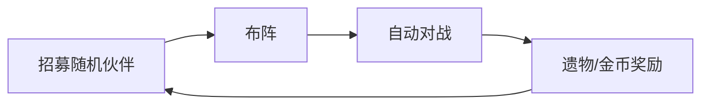
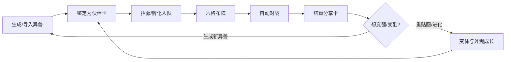
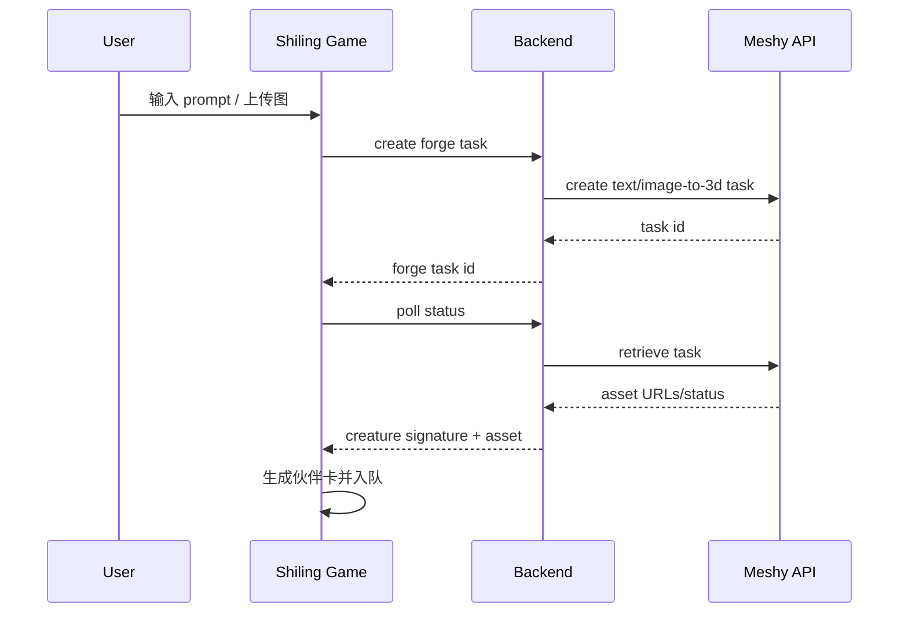

# 《食灵·列传》Meshy 结合设计：把 3D 生成变成游戏核心循环

- 日期：2026-09-15
- 状态：设计稿 v1
- 当前试玩：`https://defiabell.github.io/shiling-legends-play/`
- 当前源码：`Defiabell/shiling-legends`（private）
- 当前公开发布仓：`Defiabell/shiling-legends-play`（public, GitHub Pages）

## TL;DR

现在的《食灵·列传》是一个可玩的 2D 网页自走棋 demo，但它和 Meshy 的关系还停留在题材层，没有形成产品闭环。下一步不应该继续单纯堆自走棋系统，而应该把 Meshy 生成能力放进核心循环：

> 生成异兽 → 变成伙伴卡 → 入队养成 → 自动对战 → 结算分享 → 回到 Meshy 继续生成 / 优化 / 变体。

这个方向的价值是：游戏不只是一个外部小游戏，而是一个低门槛的 3D 生成 activation 场景。用户为了变强、收集、炫耀，会有动机完成第一次 3D 生成、查看生成结果、迭代 prompt / image，并把结果分享出去。

## Meshy 能力基线

基于 2026-09-15 官方文档，Meshy 已有以下能力可接入设计：

| 能力 | 对游戏的用途 |
|---|---|
| Text to 3D API | 用户输入“火羽狐狸、青铜角、山海经风格”等 prompt，生成初始异兽。官方 API 是 preview → refine 两步：先生成未贴图 mesh，再用 preview task id refine 出贴图版本。 |
| Image to 3D / Multi-image to 3D API | 用户上传草图、概念图或多视角图，把已有视觉设计变成异兽伙伴。 |
| Retexture API | 已有伙伴不换模型，只换皮肤、元素、血脉外观，适合做低成本成长和变体。 |
| Web App / 3D Agent | 对不懂 prompt 的用户，用对话式引导先生成概念，再进入 3D 输出；也适合做“帮我创造一只适合前排的食灵”。 |
| Export / GLB 类资产 | 游戏侧可以先用模型缩略图 / turntable / GLB viewer 展示，逐步替换现有 SVG 占位。 |

参考：官方文档提到 API 覆盖 Text to 3D、Image to 3D、texturing、remeshing、animation，并提供 API Playground 和 MCP；Text to 3D API 当前是 preview/refine 两步；Image to 3D 面向图像参考生成，Smart Topology 更适合实时/游戏资产。

## 设计原则

1. **生成必须服务玩法，不只是换皮肤。** 如果用户生成的模型只变成一张图，activation 价值有限；它必须进入队伍、影响职业、属性、技能或羁绊。
2. **属性不能由模型质量直接决定。** 不能让“生成得好看”变成“战斗更强”，否则会伤害公平和平衡。模型决定身份、风格、职业倾向；数值由游戏规则归一化。
3. **免费试玩不强迫生成。** 首局应保留现有预设伙伴，用户不登录也能玩；在关键时刻给“生成自己的异兽”作为增强动机。
4. **先 2.5D，后真 3D 战斗。** 先用缩略图/turntable/卡面替换现有 SVG，占用低、上线快；后续再把布阵区或检视器升级为 Three.js 模型预览。
5. **每次生成都要有结果承接。** 生成完成后立即进入“鉴定/孵化/入队”页面，不让用户生成完不知道干什么。

## 核心循环改造

### 现有循环



### Meshy 结合后的目标循环



## 玩家体验方案

### 首局：先玩，再生成

新用户进入后不应该先被生成表单挡住。建议首局流程：

1. 直接给 3 只预设异兽，进入第 1 战备战。
2. 第 1 战胜利后，奖励不只给遗物，也给一个“山海胚胎”。
3. 点胚胎时弹出两种选择：
   - “立即孵化随机异兽”：不登录、不生成，继续试玩。
   - “用 Meshy 生成我的异兽”：输入 prompt 或上传图，生成一只只属于自己的伙伴。

这样不会牺牲试玩转化，同时把生成入口放在用户已经理解玩法之后。

### 生成页：三步完成，不像工具表单

生成页不叫“Text to 3D”，而叫“铸灵”。

| 步骤 | 用户看到的东西 | 背后能力 |
|---|---|---|
| 选定位 | 前排守卫 / 远程术士 / 近战刺客 / 治疗灵兽 / 召唤兽 | 生成 prompt 模板 + 后续职业映射 |
| 写一句话 | “一只长着青铜角的火狐，背上有红色羽毛” | Text to 3D prompt |
| 孵化 | 显示生成进度、异兽蛋、世界观文案 | Meshy task polling/webhook |

生成完成后进入“鉴定”页：

- 左侧：3D 模型预览或 turntable。
- 右侧：自动生成伙伴卡。
- 下方：三选一血脉，不让生成结果完全随机失控。

### 鉴定规则：模型身份影响玩法，但数值归一化

从 prompt / 用户选择 / 模型标签得到 `CreatureSignature`：

```ts
type CreatureSignature = {
  source: 'text-to-3d' | 'image-to-3d' | 'imported-model';
  modelAssetId: string;
  thumbnailUrl: string;
  glbUrl?: string;
  prompt?: string;
  chosenRole: 'tank' | 'ranged' | 'assassin' | 'healer' | 'summoner';
  elements: Array<'fire' | 'water' | 'spirit' | 'wood' | 'metal' | 'earth'>;
  motifs: string[]; // horn, wing, shell, claw, flower, mask, tail...
};
```

生成伙伴卡时：

- `chosenRole` 决定基础职业模板。
- `elements` 决定羁绊。
- `motifs` 决定候选被动，例如 horn → 冲撞/破甲，wing → 远程/闪避，shell → 嘲讽/护盾。
- 数值按商店星级、伙伴星级、装备统一归一化，避免模型差异导致 pay-to-win。

## 三个可落地版本

### V0：无后端联动的“Meshy 主题铸灵”

目标：最快验证“用户愿不愿意为了游戏去生成异兽”。

实现：

- 游戏里加“铸灵”按钮。
- 给用户生成一段 Meshy prompt 模板。
- 引导用户去 Meshy Web App 生成。
- 用户把生成结果截图/模型链接贴回游戏，游戏创建一张自定义伙伴卡。
- 本地保存到 localStorage。

优点：不需要 Meshy API、不需要登录、不需要权限链路。缺点：体验断裂，无法自动拿到模型资产。

适合 1–2 天做出测试版。

### V1：API 直连的“生成异兽入队”

目标：形成真正 Meshy activation 闭环。

实现：

- 登录用户在游戏内选择定位并输入 prompt。
- 后端创建 Meshy Text/Image to 3D task。
- 生成完成后保存 `asset_id / thumbnail / glb / prompt / signature`。
- 游戏生成伙伴卡并加入胚胎或手牌。
- 结算分享卡带“由 Meshy 生成”的模型图。

需要：

- API key 不进前端，必须后端代理。
- 任务状态轮询或 webhook。
- 生成资产和用户账号绑定。
- 生成失败/取消/credits 不足的兜底。

适合正式增长实验。

### V2：Meshy Web App 内嵌活动

目标：服务 Meshy 产品 activation / retention，而不是做外部小游戏。

入口：

- Web App 首页活动卡：“生成你的第一只食灵”。
- 模型生成完成页 CTA：“放入《食灵·列传》试战”。
- My Models 操作菜单：“作为食灵出战”。
- 签到/任务系统：“今日生成 1 只异兽，通关第 3 战”。

优势：

- 用户已经在 Meshy 登录态里。
- 可以复用用户资产库。
- 能直接归因生成、查看、下载、订阅转化。

这是最适合 Meshy 增长目标的终局形态。

## 游戏系统改造

### 新资源：灵契值

生成/导入的 Meshy 异兽不应该直接给数值优势，而是给“灵契值”：

- 首次生成异兽：+1 灵契。
- 使用自己生成的异兽完成 1 场战斗：+1 灵契。
- 给异兽做一次 Retexture / 变体：+1 灵契。
- 分享通关卡：+1 灵契。

灵契值用于解锁外观槽、命名、额外胚胎栏、图鉴展示，不直接提升战斗数值。

### 新目标：图鉴收集

图鉴从“固定卡池收集”变成“我的山海异兽谱”：

- 按职业：守卫 / 术士 / 刺客 / 治疗 / 召唤。
- 按元素：火 / 水 / 灵 / 木 / 金 / 土。
- 按形态 motif：角 / 翼 / 甲 / 爪 / 花 / 面具 / 尾。
- 每个格子展示用户自己的模型缩略图。

这个系统比单局数值更适合留存，因为它是跨局积累。

### 新成长：外观进化，不破坏平衡

三种成长：

| 成长 | 是否影响战斗 | Meshy 结合 |
|---|---:|---|
| 升星 | 是 | 游戏内合成，数值变大 |
| 装备/技能 | 是 | 游戏内构筑 |
| 外观进化/重贴图 | 轻微或不影响 | Retexture / prompt refine / 变体生成 |

关键原则：用户可以为了“更帅”反复生成，但不要让付费生成直接碾压数值。

## 转化设计

### Activation 指标

| 阶段 | 事件 |
|---|---|
| 试玩进入 | `shiling_game_opened` |
| 第一次备战 | `shiling_first_prep_opened` |
| 第一次出战 | `shiling_first_battle_started` |
| 第一次胜利/失败 | `shiling_first_battle_finished` |
| 点击铸灵 | `shiling_forge_clicked` |
| 发起生成 | `shiling_meshy_generation_started` |
| 生成成功 | `shiling_meshy_generation_succeeded` |
| 生成异兽入队 | `shiling_meshy_creature_added` |
| 用自生成异兽出战 | `shiling_meshy_creature_battled` |
| 分享结算卡 | `shiling_share_card_created` |

核心 activation 定义建议：

> 用户在 24 小时内完成“首次 3D 生成 + 生成异兽入队 + 出战一次”。

### Subscription 转化点

不要一上来付费墙。转化点放在用户已经产生资产欲望之后：

1. 免费：预设伙伴 + 随机胚胎 + 每日有限铸灵。
2. 登录：保存我的异兽谱、跨设备继续。
3. 订阅：更多生成次数、更高质量、私有授权、更高分辨率贴图、批量变体、更多图鉴展示位。

推荐付费触发时机：

- 用户第 2 次点击铸灵但 credits 不足。
- 用户想把 2D 缩略图升级为 3D turntable 展示。
- 用户想对已入队异兽做 Retexture / 进化皮肤。
- 用户想生成分享卡高清版或导出 GLB。

## 引流设计

Nightide 当前做法是“GitHub Pages 可试玩 + itch 页面文案 + ZIP 包 + 截图/GIF”。《食灵·列传》应该在这个基础上强化 Meshy 资产传播：

1. **每局结算分享卡**：展示阵容模型、最高生命/攻击、第几战、生成 prompt 摘要。
2. **模型展示页**：每只异兽有独立 URL，展示 3D turntable、卡牌属性、来源 prompt。
3. **社区挑战**：固定每周 Boss，玩家用自己生成的异兽挑战，分享胜利卡。
4. **Prompt 模板传播**：分享卡附带“我用这个 prompt 生成了它”，引导别人 remix。
5. **Meshy Gallery 联动**：把优秀异兽进公共图鉴，点击可在 Meshy 里 remix / generate similar。

## 技术架构

### 前端

继续保留当前纯静态游戏壳，但增加三个模块：

```txt
src/
  meshy/
    forge-ui.ts        # 铸灵界面
    creature-card.ts   # 生成资产 → 游戏卡牌
    model-preview.ts   # thumbnail/turntable/GLB preview
  share/
    result-card.ts     # canvas 生成分享图
```

当前 `cards-client` 还是单文件 mjs demo。正式接 Meshy 前建议先整理成小模块，否则继续叠功能会很难维护。

### 后端

V1 起需要后端代理：



后端职责：

- 保存 API key。
- 控制 credits / 频率 / 登录态。
- 记录任务状态。
- 把 Meshy asset 归档到用户资产。
- 把生成结果转成游戏 `CreatureSignature`。

### 数据模型

```ts
type ShilingCreature = {
  id: string;
  ownerUserId: string;
  meshyTaskId: string;
  meshyAssetId?: string;
  source: 'text-to-3d' | 'image-to-3d' | 'multi-image-to-3d' | 'retexture';
  prompt?: string;
  thumbnailUrl: string;
  glbUrl?: string;
  role: 'tank' | 'ranged' | 'assassin' | 'healer' | 'summoner';
  element: 'fire' | 'water' | 'spirit' | 'wood' | 'metal' | 'earth';
  motifs: string[];
  passive: string;
  createdAt: string;
};
```

## 实施计划

### P0：产品验证版（1–2 天）

- 在当前线上 demo 加“铸灵”按钮。
- 提供 5 个职业 prompt 模板。
- 用户粘贴模型图/链接后，本地生成自定义伙伴卡。
- 结算分享卡标记“由 Meshy 铸灵”。
- 不接 API，不做登录。

验收：用户能从游戏跳到 Meshy 生成，再回游戏把结果变成伙伴。

### P1：线上闭环版（3–5 天）

- 后端代理 Text/Image to 3D task。
- 游戏内发起生成、轮询状态、生成伙伴入队。
- 资产保存到账号下。
- 埋点 activation funnel。
- 失败兜底：生成失败给一只随机胚胎，不中断游戏。

验收：新用户无需离开游戏即可完成一次 Meshy 生成并出战。

### P2：增长实验版（1–2 周）

- Web App 内入口。
- My Models → 作为食灵出战。
- 分享卡 / 模型展示页。
- 每周 Boss challenge。
- 订阅触发点和 credits 策略。

验收：能看 activation、retention、subscription uplift，不只是 DAU。

## 最大风险

| 风险 | 解决方式 |
|---|---|
| 生成等待太久，游戏节奏断 | 首次生成放在战后奖励；等待时允许继续备战/看图鉴；完成后通知入队。 |
| 生成质量不稳定 | 用户先选职业模板；生成结果只影响身份和外观，数值归一化。 |
| 成本不可控 | 免费每日限次；P0 不接 API；P1 按登录/订阅/credits 控制。 |
| 游戏变成工具 demo | 每次生成都必须进入战斗和分享闭环，不能停在模型展示。 |
| 自走棋题材同质化 | 差异点放在“我的 AI 生成异兽”和“山海图鉴”，不是和 TFT 拼系统复杂度。 |

## 推荐结论

先做 P0，不要一上来接完整 Meshy API。原因：我们现在还没有证明“为了玩这个游戏，用户愿不愿意生成自己的异兽”。P0 用最低成本验证这个动机；如果用户愿意跳去 Meshy 生成并把模型带回游戏，再做 P1 API 闭环。

P0 具体要做的最小版本：

1. 游戏内新增“铸灵”入口。
2. 选择职业，生成 Meshy prompt。
3. 用户可粘贴图片 URL / 模型 URL / 上传本地图，创建自定义伙伴。
4. 自定义伙伴加入手牌，拥有职业、元素、被动和数值角标。
5. 战斗结束生成分享卡，展示自定义伙伴。

这会把《食灵·列传》从“一个普通自走棋 demo”推进到“Meshy 的游戏化 3D 生成入口”。
